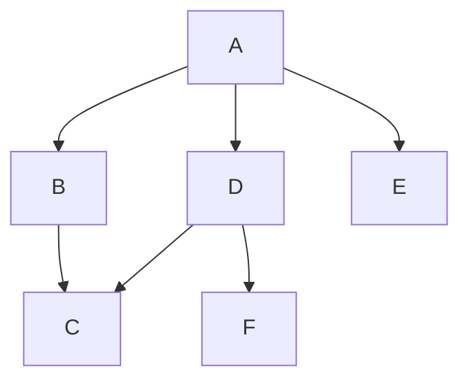

## DAG Example

Implemented an adjacency list representation for the following directed acyclic graph:

```mermaid
graph TD
    A --> B
    A --> D
    A --> E
    B --> C
    D --> C
    D --> F
```
