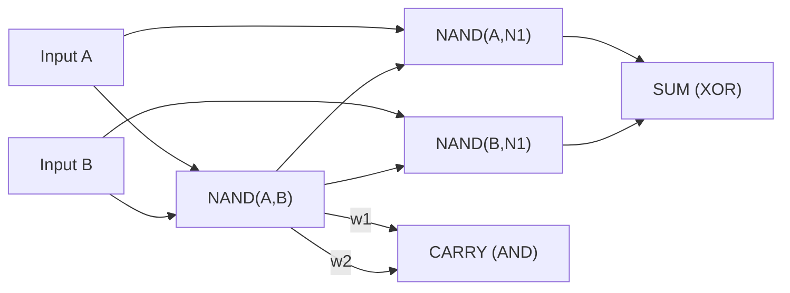

# Perceptron-Based Logic Circuit in C

Implemented a **bit adder using perceptrons configured as NAND gates**.

The focus is on:
- representing computation as a **graph (adjacency list)**
- executing it as a **DAG**
- ordering execution using **Kahn’s Algorithm**
- handling **manual memory management in C**

---

## Perceptron Configuration (NAND)

Each perceptron is configured to behave as a NAND gate:

- **Weights:** `-2` (for every incoming edge)  
- **Bias:** `+3`

```c
output = (input_sum + bias <= 0) ? 0 : 1;
```
---

## Circuit (Half Adder)


